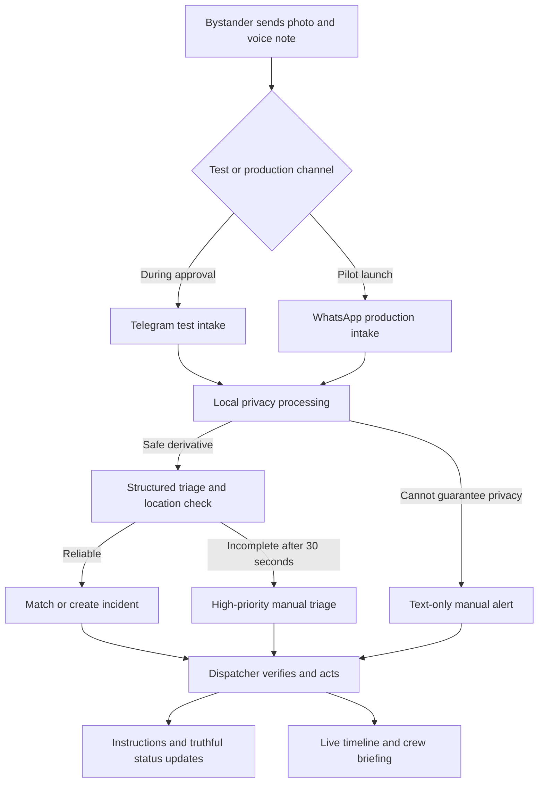

# First10 Live Pilot Requirements

## Summary

First10 will deliver the project paper's complete bystander-to-dispatch workflow as a live
September pilot. The product will use a compact modular-monolith architecture that two builders
can operate, with portable infrastructure, OpenAI GPT as the intentional AI dependency, Telegram
as the temporary end-to-end test channel, and WhatsApp as the production reporting channel.

---

## Problem Frame

Road-crash dispatch loses critical time before FRSC receives a usable location, severity signal,
and casualty estimate. A bystander may have WhatsApp but cannot reasonably install an app,
create an account, complete an English form, or conduct a structured phone interview during the
first moments after a crash. A serving FRSC commander has already demonstrated that informal
WhatsApp reporting by corridor community members can work, but the manual approach depends on
one person triaging unstructured reports.

The project is already inside the paper's planned build window, while none of its external launch
prerequisites is secured. The technical system must therefore advance through realistic channel
testing without confusing software readiness with legal, clinical, or operational approval.

The prose requirements below are authoritative if the diagram and prose ever differ.

---

## Actors

- A1. Bystander/reporter: Reports a road crash, receives safety guidance, and receives limited
  response-status updates without seeing victim identity.
- A2. FRSC dispatcher: Reviews structured and escalated reports, verifies incidents, controls
  dispatch status, and uses the evolving incident timeline.
- A3. Responding crew: Receives a concise, current briefing derived from the incident timeline.
- A4. First10 operator/administrator: Manages access, provider configuration, incidents requiring
  operational intervention, retention, and audit review.
- A5. Clinical advisor: Authors or approves every safety-instruction template before it can be
  enabled for reporters.

---

## Key Flows

- F1. Bystander report to dispatcher ticket
  - **Trigger:** A1 sends a crash photo and voice note through an enabled reporting channel.
  - **Actors:** A1, A2, A4
  - **Steps:** The channel acknowledges receipt and opens a short guided reporting session; photo
    and voice inputs are accepted in either order; the channel requests whichever expected input is
    missing; raw media enters privacy processing; only a privacy-safe image may continue; the system
    extracts incident details and location; it requests a location pin when necessary; a structured
    ticket or high-priority manual alert reaches A2.
  - **Failure path:** If privacy processing fails, the image is discarded and the text/audio-derived
    report continues without it. If automated triage is unreliable after 30 seconds, the report is
    surfaced for manual triage and A1 is advised to call 122 when safely possible.
  - **Outcome:** A2 sees an actionable report without waiting indefinitely for automation.
  - **Covered by:** R1, R2, R3, R4, R5, R6, R7

- F2. Multi-reporter verification and live timeline
  - **Trigger:** A later report may describe an incident already open on the corridor.
  - **Actors:** A1, A2, A3
  - **Steps:** The system compares time and location; qualifying reports merge into one incident;
    evidence is ordered chronologically; material contradictions are highlighted; the consolidated
    view remains traceable to each source report.
  - **Failure path:** An uncertain match remains separate and is presented to A2 for review rather
    than being silently merged.
  - **Outcome:** A2 and A3 receive one evolving, source-traceable incident account.
  - **Covered by:** R8, R9, R10

- F3. Reporter guidance and response closure
  - **Trigger:** A report is accepted for verification or A2 changes response status.
  - **Actors:** A1, A2, A5
  - **Steps:** The system selects an enabled, clinically approved instruction template; sends text
    and voice guidance in the reporter's language; and sends dispatch, arrival, and transport
    updates only after the matching explicit dispatcher action.
  - **Failure path:** If no approved template matches safely, the conservative default guidance is
    used. If response status is unknown, no status update is invented.
  - **Outcome:** A1 receives immediate safety-first guidance and truthful closure without victim
    identity or medical details.
  - **Covered by:** R11, R12

- F4. Govern and evaluate the pilot
  - **Trigger:** A4 provisions a user, changes an approved configuration, investigates a failure,
    or evaluates pilot performance.
  - **Actors:** A2, A4, A5
  - **Steps:** Access is authenticated and role-limited; material actions are audited; retention
    jobs delete expired media and records; operational and pilot metrics show latency, coverage,
    reliability, accuracy, and delivery outcomes without exposing unnecessary personal data.
  - **Outcome:** The pilot is operable, reviewable, and measurable against its stated gates.
  - **Covered by:** R13, R14, R15, R16, R17, R18

---

## Requirements

**Channel and intake**

- R1. Telegram must provide a temporary end-to-end test channel, while direct Meta WhatsApp Cloud
  API integration must be the production bystander channel. Both must invoke the same
  channel-independent incident behavior.
- R2. The first photo or voice note must open a time-bounded guided reporting session. Photo and
  voice inputs must be accepted in either order, the reporter must be prompted for whichever input
  is missing, and a later location reply must attach to the same session. Intake must retain
  reporter/channel identity, message identity, and timestamps. Duplicate webhook delivery must not
  create duplicate reports, instructions, or dispatch updates.
- R3. The reporter must receive a prompt acknowledgement, and the system must support English,
  Nigerian Pidgin, and Yoruba for intake, safety guidance, location requests, and status updates.

**Privacy and data governance**

- R4. An unblurred image may exist only transiently in application memory during local face
  processing. It must never be written to persistent storage, logged, included in telemetry, sent
  to an external AI provider, or forwarded to FRSC. When safe redaction cannot be guaranteed, the
  report must continue without the image.
- R5. Approved external AI processors may receive reporter audio and face-blurred images only
  under approved processing and international-transfer safeguards. Provider calls must avoid
  unnecessary identifiers.
- R6. Blurred media and reporter audio must expire after 30 days by default; structured incident
  and audit records must expire after 12 months by default. Retention must be configurable and
  deletions must be auditable.

**Triage, location, and safe degradation**

- R7. Automated triage must produce incident type, severity, casualty estimate, language,
  extracted location description, location confidence, and an explanation/evidence reference
  suitable for dispatcher review. AI output is decision support; A2 owns verification and dispatch.
- R8. A clear voice-cue location must populate the ticket. When the location is missing or below
  the agreed confidence threshold, the system must request a WhatsApp/Telegram location pin in the
  reporter's language and remind once after 30 seconds.
- R9. If reliable automated triage is not available within 30 seconds, the system must create a
  prominent manual-triage alert using available privacy-safe inputs, tell the reporter that review
  is underway, and advise calling FRSC 122 when safely possible.

**Incident verification, relay, and crew handoff**

- R10. Reports within 200 metres and five minutes must be considered for the same incident. Two
  qualifying independent reporters auto-verify the incident; singletons enter a 60-second human
  review queue; uncertain matches remain separate until A2 decides.
- R11. Every merged incident must maintain a chronological, source-traceable timeline. Conflicting
  casualty, severity, location, or victim-state claims must be visibly flagged rather than silently
  reconciled. A current concise briefing must be available to A3 through A2's workflow without a
  separate crew application.

**Reporter care and response closure**

- R12. The system must select—but never freely generate—safety guidance from an enabled library
  whose every template has A5 approval. Guidance must be available as text and voice in all three
  pilot languages, target delivery within 30 seconds, and fall back conservatively when uncertain.
- R13. Dispatch, arrival, and transport messages must be sent only after the corresponding explicit
  A2 action. Updates must not include victim identity, personalised medical information, or an
  outcome beyond the approved response status.

**Operations, access, and reliability**

- R14. The dispatcher console must use invitation-only access, multi-factor authentication,
  role-based permissions, session controls, and auditable administrative and dispatcher actions.
- R15. State changes and outbound work must be durable and idempotent. Provider failures must use
  bounded retries, visible failure states, and manual recovery; they must not fabricate success,
  duplicate reporter messages, or lose accepted incidents.
- R16. The console must update active incidents in near real time and clearly distinguish new,
  awaiting-location, manual-review, verified, dispatched, arrived, transported, closed, conflicted,
  and delivery-failed states.
- R17. Operations must expose privacy-safe logs, traces, health signals, and alerts. Pilot metrics
  must include intake-to-ticket latency, intake-to-dispatch time, ticket completeness, triage
  accuracy, redaction success, instruction coverage/latency, closure coverage, delivery failures,
  and multi-report conflict handling.

**Recognition**

- R18. Verified reporter contributions may earn a non-monetary Citizen First Responder badge and
  LGA-level recognition. NYSC service-hour credit must remain disabled until a formal partner
  approves it, and recognition must not reveal incident or victim details.

---

## Acceptance Examples

- AE1. **Covers R1, R2.** Given the same staged report is submitted once through Telegram and once
  through WhatsApp, when each channel adapter accepts it, both create equivalent domain input and
  follow the same triage, instruction, timeline, and status-update behavior.
- AE2. **Covers R2, R15.** Given Meta retries an already accepted webhook with the same message
  identity, when it is received again, no second report, instruction, or dispatcher action is
  created.
- AE2a. **Covers R2.** Given a reporter sends a voice note before a photo, when the photo arrives
  within the guided-session window, both inputs and any subsequent location pin form one report.
  If the companion input never arrives, the session times out into visible manual review instead of
  disappearing.
- AE3. **Covers R4, R9.** Given face processing throws an error, when intake continues, no raw image
  is persisted or forwarded; A2 receives a text/audio-derived manual alert and A1 is not told that
  the image was processed successfully.
- AE4. **Covers R7, R8.** Given a reporter says "Mowe inbound, near the toll gate" with adequate
  confidence, when triage completes, the location description appears on the ticket without an
  unnecessary pin request.
- AE5. **Covers R8, R9.** Given the voice note contains no usable location, when no pin arrives after
  the initial request and one reminder, the incident remains visible to A2 with its location gap
  prominent rather than being discarded.
- AE6. **Covers R9.** Given an AI provider is unavailable for more than 30 seconds, when the report
  has been privacy-processed, A2 receives a high-priority manual alert and A1 receives a truthful
  review message plus the conditional 122 recommendation.
- AE7. **Covers R10, R11.** Given two independent reports arrive four minutes apart and 120 metres
  apart, when the second is accepted, both reports appear in one auto-verified timeline. If their
  casualty estimates differ, the conflict is visibly flagged with both source values preserved.
- AE8. **Covers R12.** Given a high-severity non-fire crash reported in Yoruba, when the matching
  template is clinically enabled, A1 receives that approved Yoruba text and voice guidance; the AI
  does not add novel clinical wording.
- AE9. **Covers R13, R15.** Given a verified incident has no dispatcher-arrived action, when an
  outbound worker retries pending messages, no arrival notification is created. After A2 records
  arrival once, exactly one approved arrival update is sent to each linked reporter.
- AE10. **Covers R6, R17.** Given media has exceeded its 30-day policy, when retention enforcement
  runs, the media is deleted, the deletion is audited without retaining the media itself, and
  anonymized pilot aggregates remain usable.

---

## Success Criteria

- At least 30 verified pilot reports complete the end-to-end workflow, with a measured reduction
  of at least 70% in average time to dispatch versus the agreed FRSC baseline.
- Every dispatched ticket contains location or a prominent location gap, incident type, severity,
  and casualty estimate; uncertainty remains visible to A2.
- At least 90% of verified reports receive clinically approved safety guidance, with median
  delivery within 30 seconds and zero free-form clinical messages.
- At least 80% of verified reports receive at least one truthful closure update.
- Every multi-report incident produces one source-traceable timeline, with all planted or observed
  material contradictions flagged.
- No unblurred image is persisted, logged, sent to an AI provider, or forwarded to FRSC; the
  corridor validation set meets the paper's redaction quality gate before launch.
- The production GPT model configuration is supported by documented English, Pidgin, and Yoruba
  benchmark results for accuracy, latency, data terms, and cost.
- FRSC operational approval, clinical template approval, Meta production access, and legal/NDPA
  approval are recorded before real public reporting is enabled.
- An implementer can trace every implementation unit and verification scenario back to these
  requirements without inventing product behavior.

---

## Scope Boundaries

- Telegram is a testing contingency, not a permanent public reporting channel.
- No native iOS or Android application will be built.
- First10 will complement, not replace, the FRSC mobile app, 122 hotline, or downstream dispatch
  system.
- No free-form AI medical advice, diagnosis, treatment decision, or live clinician interaction is
  allowed.
- Hospital coordination, non-road incidents, national rollout, monetisation, and a 24/7 production
  SLA are excluded.
- Police, NEMA, LASEMA, and other agency integrations are excluded from the pilot.
- No separate responding-crew application will be built; crew briefing remains part of the
  dispatcher workflow.
- Microservices, Kubernetes, an external message broker, active-active regions, and speculative
  scale infrastructure are excluded unless verified pilot load or reliability evidence makes one
  necessary.

---

## Key Decisions

- Backend and frontend: ASP.NET Core on .NET 10 LTS for the backend; React with TypeScript, Vite,
  TanStack Query, and TanStack Router for the dispatcher console.
- Application shape: A modular monolith organized by the product modules Intake, Incidents,
  Dispatch, Guidance, Recognition, Identity/Audit, and Operations. These are code boundaries, not
  services. Production has exactly one deployed API process and one deployed worker process, both
  composed from the shared module code.
- Local orchestration: .NET Aspire runs the API, worker, Vite development server, PostgreSQL,
  object storage, and shared development telemetry. Aspire is a development convenience rather
  than an additional production runtime dependency.
- Persistence and messaging: PostgreSQL with EF Core for operational state, an append-only incident
  event timeline, and Wolverine for mediator handling, PostgreSQL-backed transport queues,
  scheduled work, retries, and the transactional inbox/outbox shared by the API and worker.
- Media storage: S3-compatible object storage behind an application-owned abstraction; only
  privacy-safe derivatives may be stored.
- Privacy inference: Face detection and redaction run inside the .NET worker through a replaceable
  ONNX Runtime detector. Redaction fails closed and is validated against a representative corridor
  image set before launch.
- Channels: Telegram enables immediate end-to-end testing; direct Meta WhatsApp Cloud API is the
  production path; channel adapters share the same domain use cases.
- Intake grouping: The first photo or voice note opens a short guided session; companion media and
  location are accepted in any order and correlated before the session completes or times out.
- AI: OpenAI GPT is the selected external AI provider behind application-owned interfaces. The
  Responses API supplies structured multimodal triage and safe template selection from
  face-blurred images and minimally identified text; GPT-4o Transcribe is the speech-to-text
  baseline. GPT model tiers are benchmarked on the shared multilingual dataset before the
  production configuration is pinned. Approved voice guidance is pre-generated and clinically
  reviewed so live speech synthesis is not on the emergency-response critical path.
- Identity: ASP.NET Core Identity provides invitation-only users, TOTP MFA, roles, and session
  controls for the small pilot group.
- Live operations: The console receives real-time server updates, while query caching remains the
  recoverable source for refresh and reconnect.
- Observability and deployment: OpenTelemetry-compatible telemetry and OCI containers keep
  monitoring and hosting portable across approved foreign regions. The production topology
  remains one API workload and one worker workload rather than a deployment per product module.

---

## Dependencies / Assumptions

- A signed FRSC LOI, named dispatcher participants, workflow validation, and permission to operate
  the pilot are required before live emergency use.
- Meta Business verification, WhatsApp Business Account approval, a production number, templates,
  and webhook configuration are not yet secured.
- A clinical advisor and a fully approved three-language instruction library are required before
  micro-instructions can be enabled outside controlled tests.
- Legal review must approve consent, retention, processor terms, international transfers,
  decision-support framing, access controls, and the raw-media handling design.
- Corridor volunteers and staged-scenario participants are not yet recruited.
- Baseline dispatch timing and the labelled evaluation datasets for triage, multilingual voice,
  face redaction, incident matching, and planted contradictions still need to be assembled and
  approved.
- The approved foreign hosting region must provide encryption in transit and at rest, backup
  controls, access logging, deletion support, and acceptable processor/subprocessor terms.
- Telegram test users will be explicitly told that Telegram is a controlled test channel, not the
  public emergency-reporting service.

---

## Outstanding Questions

### Deferred to Planning

- [Affects R4, R17][Needs research] Which commercially usable ONNX face model and image-processing
  library best meet the representative redaction benchmark in .NET?
- [Affects R5, R7, R12][Needs research] Which GPT model tier, image-detail setting, transcription
  configuration, timeout, and retry policy performs best on the shared English, Pidgin, and Yoruba
  evaluation set while remaining affordable for the pilot?
- [Affects R1, R15][Technical] What adapter contract and recorded fixtures will demonstrate
  behavioral parity between Telegram and WhatsApp without coupling domain logic to either payload?
- [Affects R14][Technical] Which recovery and break-glass process preserves secure dispatcher
  access when an MFA device or operator account is unavailable?
- [Affects R15, R16][Technical] What deployment topology and capacity preserve the 30-second path
  while keeping PostgreSQL-backed durable queues observable and recoverable?
- [Affects R6][Needs research] Which approved hosting region and S3-compatible store provide
  enforceable lifecycle deletion and acceptable international-transfer terms within budget?

---

## Source

- `first10-project-paper.md`
