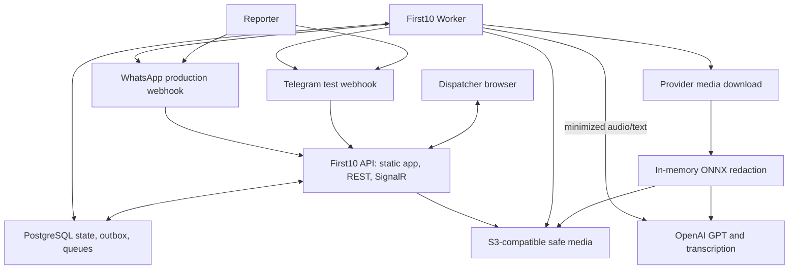
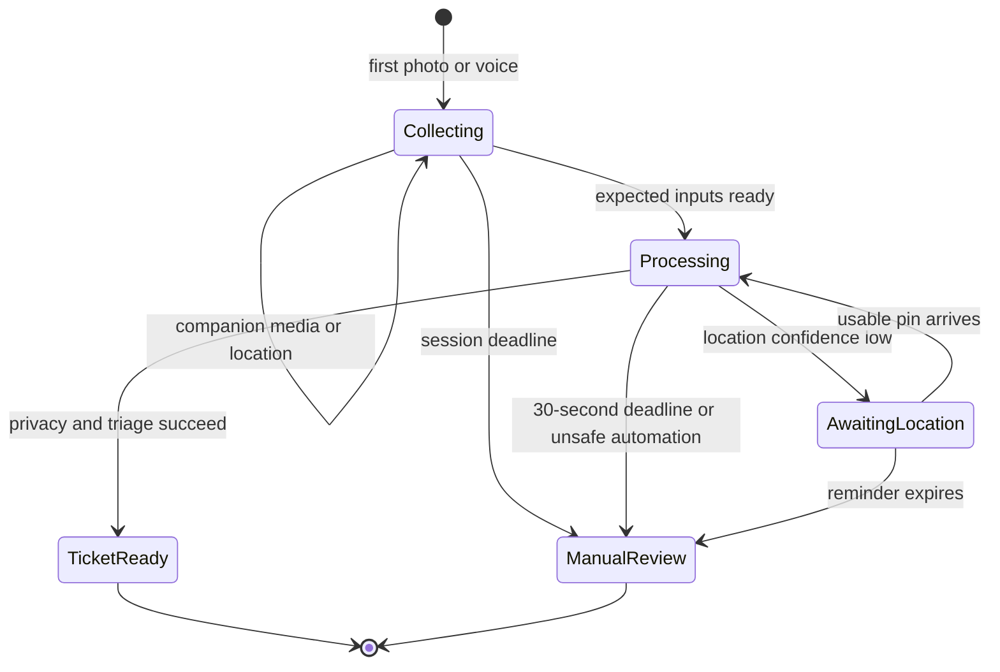
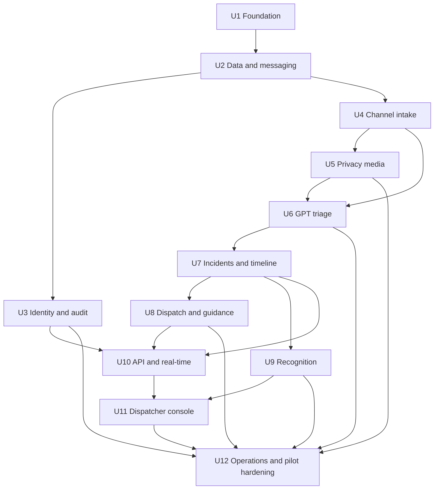
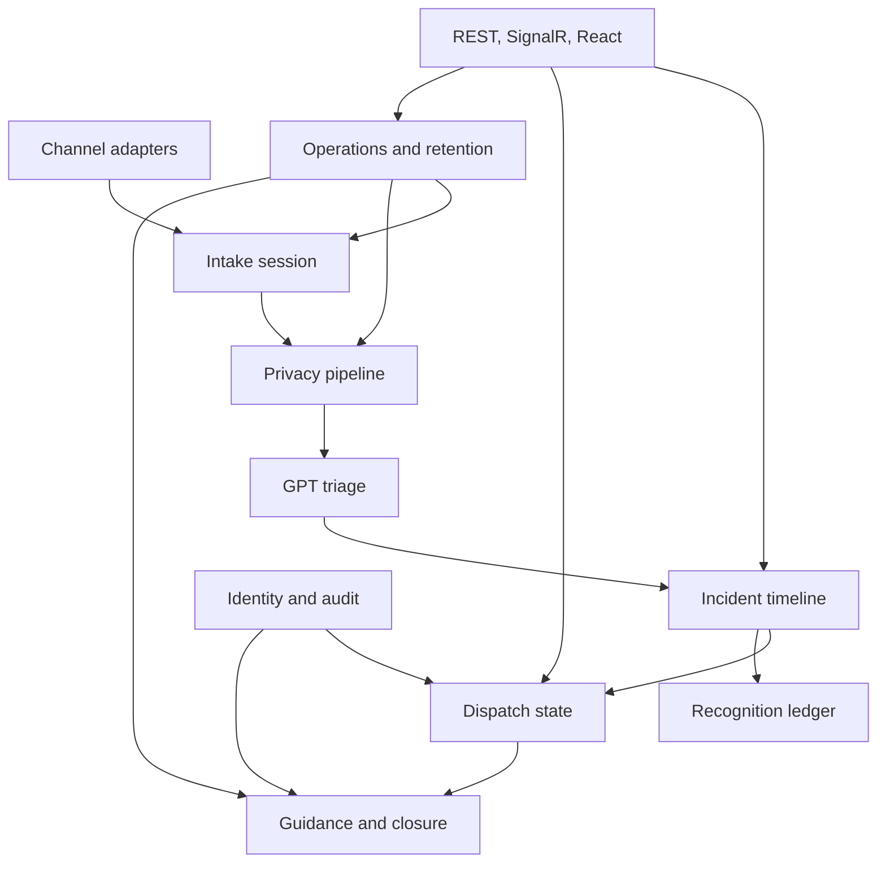

# feat: Build the First10 live pilot

## Summary

Build First10 as a .NET 10 modular monolith whose product modules are internal code boundaries,
not services. Compose those modules into exactly one ASP.NET Core API and one background worker in
production, serve the built React application from the API, and use .NET Aspire to orchestrate the
API, worker, Vite development server, PostgreSQL, object storage, and telemetry during local
development.

The worker owns durable intake workflows, privacy processing, OpenAI GPT calls, incident matching,
and outbound delivery through PostgreSQL-backed Wolverine queues. The plan deliberately front-loads
privacy, idempotency, channel parity, and the 30-second manual-degradation path because those are the
highest-risk properties of a live emergency-response pilot.

---

## Problem Frame

First10 must turn a bystander's photo and voice note into a privacy-safe, usable FRSC incident in
seconds while preserving human dispatch authority. It is a greenfield build with a September pilot
target and no secured operational, legal, clinical, channel, or volunteer prerequisite yet; the
software must therefore support controlled Telegram testing without presenting technical readiness
as permission for public emergency use (see origin:
`docs/brainstorms/2026-07-20-first10-pilot-requirements.md`).

---

## Requirements

All R-IDs below preserve their meaning from the origin document.

- R1–R3. Provide equivalent Telegram test and direct Meta WhatsApp production intake, a
  time-bounded guided session accepting photo/voice/location in any order, idempotent message
  handling, prompt acknowledgement, and English/Pidgin/Yoruba communication.
- R4–R6. Keep raw images in worker memory only, fail closed when redaction is uncertain, minimize
  data sent to OpenAI, and enforce auditable 30-day media/audio and 12-month structured-record
  retention defaults.
- R7–R9. Produce structured decision-support triage and location confidence, request a location pin
  when needed, and surface a prominent manual-review ticket no later than the 30-second deadline.
- R10–R11. Match reports using the 200-metre/five-minute rule, auto-verify only qualifying
  independent reports, preserve source-traceable claims and contradictions, and provide a concise
  crew briefing.
- R12–R13. Select only clinically enabled guidance, deliver approved text and voice assets, and send
  status messages only after explicit dispatcher transitions.
- R14–R17. Provide invitation-only MFA-protected access, durable/idempotent state changes, near
  real-time console updates, privacy-safe observability, operational recovery, and pilot metrics.
- R18. Award privacy-preserving, non-monetary recognition only for verified contributions; keep NYSC
  credit disabled until a partner explicitly approves it.

**Origin actors:** A1 bystander/reporter, A2 FRSC dispatcher, A3 responding crew, A4 First10
operator/administrator, A5 clinical advisor.

**Origin flows:** F1 report-to-ticket, F2 multi-reporter verification and timeline, F3 guidance and
response closure, F4 governance and evaluation.

**Origin acceptance examples:** AE1 channel parity; AE2 duplicate delivery; AE2a media ordering and
session timeout; AE3 fail-closed redaction; AE4 voice-cue location; AE5 missing pin; AE6 AI timeout;
AE7 report merge and conflict; AE8 approved Yoruba guidance; AE9 truthful exactly-once status;
AE10 retention deletion.

---

## Scope Boundaries

- Product modules are code boundaries inside one backend, not independently deployed services.
- Production contains one First10 API workload and one First10 worker workload. PostgreSQL and
  object storage are managed dependencies, not additional application services.
- Aspire is for local development orchestration and diagnostics; production does not depend on an
  Aspire AppHost.
- Telegram is a controlled testing contingency, not the permanent public channel.
- The dispatcher interface is a responsive web application; there is no native mobile application
  and no separate responding-crew application.
- First10 complements FRSC 122 and the existing FRSC app. It does not replace the downstream
  dispatch system or make autonomous dispatch decisions.
- GPT may classify, extract, summarize with source references, and select an enabled template. It
  may not generate clinical instructions, diagnoses, treatment decisions, or unverified response
  status.
- No raw image persistence, external message broker, event-sourcing framework, microservices,
  Kubernetes, active-active deployment, multi-provider AI runtime failover, hospital integration,
  non-road incident support, or national rollout is in scope.

### Deferred to Follow-Up Work

- Production hosting vendor/region selection: decide after legal review of international transfer,
  processor terms, deletion, backup, and budget controls; the implementation remains OCI- and
  S3-compatible.
- NYSC service-hour integration: separate product and partner work after written approval.
- FRSC downstream-system integration: use the dispatcher console and crew briefing during the
  pilot; design a formal integration only if FRSC requests it.

---

## Context & Research

### Relevant Code and Patterns

- The repository is greenfield. The only authoritative local artifacts are
  `first10-project-paper.md` and
  `docs/brainstorms/2026-07-20-first10-pilot-requirements.md`; there are no application patterns to
  preserve.
- Product modules will therefore use explicit namespaces, internal-by-default types, module-owned
  commands/events, and architecture tests to prevent cross-module entity access. `First10.Api` and
  `First10.Worker` are composition roots that reference the same module assembly.
- Cross-module collaboration uses immutable contracts and Wolverine messages. Queries used by the
  dispatcher read purpose-built projections rather than reaching into another module's domain
  model.

### Institutional Learnings

- No `docs/solutions/` directory or prior implementation history exists. The plan treats all local
  framework conventions as new decisions that must be captured by architecture tests and short
  decision records.

### External References

- [.NET releases and support](https://learn.microsoft.com/en-us/dotnet/core/releases-and-support)
  identifies .NET 10 as an LTS release.
- [Add Aspire to an existing app](https://learn.microsoft.com/en-us/dotnet/aspire/get-started/add-aspire-existing-app)
  establishes the AppHost and ServiceDefaults split used only for local orchestration here.
- [Wolverine PostgreSQL persistence and transport](https://wolverinefx.net/guide/durability/postgresql),
  [EF Core integration](https://wolverinefx.net/guide/durability/efcore/), and
  [durability guidance](https://wolverinefx.net/guide/durability/) support a transactional inbox,
  outbox, and PostgreSQL-backed queues without RabbitMQ.
- [OpenAI model guidance](https://developers.openai.com/api/docs/models) supports evaluating the
  GPT-5.6 Sol, Terra, and Luna tiers; Luna is the initial latency/cost baseline, not an untested
  production commitment. [GPT-4o Transcribe](https://developers.openai.com/api/docs/models/gpt-4o-transcribe)
  is the speech-to-text baseline.
- [Telegram Bot API](https://core.telegram.org/bots/api), Meta's official
  [WhatsApp Business Platform collection](https://www.postman.com/meta/whatsapp-business-platform/overview),
  and Meta's [WhatsApp API examples](https://github.com/fbsamples/whatsapp-api-examples) define the
  two external channel contracts and webhook security expectations.
- [ONNX Runtime C# guidance](https://onnxruntime.ai/docs/tutorials/csharp/basic_csharp.html) supports
  in-process worker inference. Any detector model still requires a commercial-use and corridor
  quality review before it is pinned.
- [ASP.NET Core SignalR security](https://learn.microsoft.com/en-us/aspnet/core/signalr/security?view=aspnetcore-10.0)
  requires explicit origins, HTTPS, protected credentials, and non-disclosure of detailed server
  exceptions.
- [TanStack Router with Vite](https://tanstack.com/router/v1/docs/installation/with-vite) and
  [TanStack Query defaults](https://tanstack.com/query/latest/docs/framework/react/guides/important-defaults)
  inform route generation and deliberate query freshness/retry settings for operational data.
- The [Nigeria Data Protection Act 2023](https://ndpc.gov.ng/download/nigeria-data-protection-act-2023)
  remains the legal source; implementation controls do not substitute for the required DPIA and
  legal approval.

---

## Key Technical Decisions

| Decision | Resolution and rationale |
|---|---|
| Backend boundaries | Use one `First10.Modules` assembly organized by the seven product modules. Keep domain/application types internal where possible, expose only module registration and contracts, and enforce dependency rules with architecture tests. This gives the two-person team real boundaries without seven separately versioned services. |
| Runtime topology | `First10.Api` terminates HTTP, serves the React build, authenticates console users, validates webhooks, and enqueues work. `First10.Worker` consumes all domain, provider, and scheduled workflows. The API consumes only a dedicated UI-notification queue so worker commits can be broadcast through SignalR. Both processes use the same module code and PostgreSQL transport. |
| Local topology | `First10.AppHost` starts API, worker, Vite, PostgreSQL, S3-compatible storage, and the Aspire dashboard. `First10.ServiceDefaults` centralizes health checks and OpenTelemetry defaults. Neither is a third production workload. |
| Persistence | Use PostgreSQL through EF Core for current state and an append-only incident timeline. Keep one operational DbContext for pilot simplicity, use schema/table ownership and module configurations, prohibit domain entity navigation across modules, and communicate across modules using contracts. |
| Durable work | Use Wolverine's transactional EF Core outbox/inbox and PostgreSQL transport queues. Unique external-message and semantic outbound keys provide business idempotency in addition to transport-level deduplication. |
| Frontend delivery | Build React/Vite assets into the API image and serve them same-origin in production. During development, Aspire runs Vite with an API/SignalR proxy. Use secure HTTP-only cookies plus antiforgery protection rather than browser-stored bearer tokens. |
| Raw-media boundary | The API persists only the provider media handle and metadata. The worker downloads the raw image directly from Telegram/Meta, decodes and redacts it in bounded memory, stores only the blurred derivative, then releases buffers. A redaction failure discards the image and continues text/audio-only. |
| Reporter addressing | Intake owns the only reversible channel destination. Store an encrypted, versioned destination for required replies and a separately keyed pseudonymous lookup value for correlation; downstream modules receive only an opaque contact reference. Back the encryption boundary with the selected host's managed key/secret facility, rotate keys through a runbook, and remove the destination when its approved retention/communication purpose ends. |
| GPT boundary | Use application-owned interfaces backed by OpenAI. GPT receives only minimized transcript/text and a face-blurred image. Request structured triage output; do not use agentic tools on the emergency path. Start evaluation with GPT-5.6 Luna at low/none reasoning and explicitly compare Terra/Sol where measured quality justifies latency/cost. |
| Deadline behavior | Maintain one end-to-end intake deadline. Provider calls use budgets inside that deadline; retries may not extend it. At 30 seconds the workflow creates manual review and sends truthful fallback messaging. Later enrichment may continue only if it cannot overwrite dispatcher decisions or duplicate reporter messages. |
| Guidance safety | Store immutable, versioned, clinically approved text and pre-generated voice assets. GPT can return an enabled template identifier; deterministic policy validates eligibility and chooses the conservative default on uncertainty. Runtime speech synthesis is not required to meet the emergency deadline. |
| Incident matching | Calculate distance only from accepted coordinates derived from a pin or a confidence-qualified gazetteer match. The 200-metre/five-minute rule produces a candidate; independent reporter identity and confidence gates control auto-verification. Ambiguous landmark matches remain separate for dispatcher review. |
| Real-time UI | After a worker transaction commits, its outbox sends a small projection-changed contract to an API-owned PostgreSQL queue; the API broadcasts an idempotent SignalR invalidation. REST/OpenAPI remains the recoverable command/query contract, and TanStack Query refetches authoritative state after reconnect, duplicate notifications, or version gaps. The pilot runs one API replica; horizontal API scaling requires an explicit SignalR fan-out/backplane decision. |
| Production portability | Publish two OCI images. Keep PostgreSQL, object storage, OpenTelemetry exporters, and secrets behind standard configuration. Select an approved hosting region later without changing domain code. |

---

## Open Questions

### Resolved During Planning

- **How do API and worker exchange durable work without a broker?** Use Wolverine's PostgreSQL
  transport with EF Core outbox/inbox. Local in-memory queues are not a cross-process boundary.
- **How is channel parity proven?** Normalize both webhooks into the same versioned inbound envelope
  and replay equivalent, sanitized recorded fixtures through one contract suite.
- **How can raw images reach a separate worker without being stored?** Persist only the provider
  media identifier; the worker downloads and redacts the image directly in memory before any
  object-store write or GPT call.
- **What happens when the AI path consumes the deadline?** A durable deadline message races the
  enrichment path. The first terminal outcome wins through an optimistic version/idempotency guard;
  manual review becomes visible at 30 seconds even if late enrichment subsequently arrives.
- **How is secure access recovered?** Issue single-use MFA recovery codes at enrollment; require an
  authenticated administrator with recent reauthentication to reset another user's MFA; keep one
  named, offline break-glass procedure with every use alerted and audited. Never share accounts.
- **What is deployed?** Exactly one API image and one worker image. The React build is served by the
  API; Aspire is not deployed as an application runtime.

### Deferred to Implementation

- **Exact ONNX detector and threshold:** run the privacy benchmark against commercially usable
  candidates and representative corridor images; pin the model checksum only after it satisfies
  the agreed recall/fail-closed gate.
- **Exact GPT tier, reasoning effort, image detail, and provider timeout:** benchmark Luna, Terra,
  and Sol on the labelled multilingual set, then pin a versioned configuration. The model family
  and OpenAI boundary are decided; the empirical tuning is not.
- **Exact guided-session collection window and overlap rule:** validate the default with staged
  reporter exercises and FRSC operations. The workflow and tests must use an explicit configurable
  value; implementation may not silently choose or hide the expiry behavior.
- **Final landmark gazetteer entries:** FRSC must validate names, aliases, directions, coordinates,
  and dispatch usefulness for Berger-to-Mowe before they are enabled.
- **Production hosting region and S3 implementation:** select only after legal, cost, lifecycle,
  encryption, backup, and data-processing review.
- **WhatsApp template identifiers and production number:** bind configuration after Meta approval;
  local and CI tests use sanitized fixtures and fake senders.

---

## Output Structure

The tree is the intended shape, not a requirement to reproduce every placeholder file before its
owning implementation unit lands.

```text
First10.slnx
global.json
Directory.Build.props
Directory.Packages.props
.editorconfig
.github/workflows/ci.yml
src/
  First10.AppHost/
  First10.ServiceDefaults/
  First10.Api/
  First10.Worker/
  First10.Modules/
    BuildingBlocks/
    Intake/
    Incidents/
    Dispatch/
    Guidance/
    Recognition/
    IdentityAudit/
    Operations/
  First10.Infrastructure/
    Persistence/
    Modules/
      Intake/
      Incidents/
      Dispatch/
      Guidance/
      Recognition/
      IdentityAudit/
      Operations/
web/
  src/
    routes/
    features/
      incidents/
      dispatch/
      guidance/
      recognition/
      identity-audit/
      operations/
  tests/e2e/
tests/
  First10.ArchitectureTests/
  First10.UnitTests/
  First10.IntegrationTests/
  First10.ContractTests/
  First10.PrivacyBenchmarks/
  First10.AiBenchmarks/
  First10.LoadTests/
benchmarks/
  README.md
  manifests/
  expected/
data/
  corridors/
assets/
  guidance/
tools/
  First10.GuidanceAssets/
infra/
  compose.yaml
docs/
  decisions/
  runbooks/
```

---

## High-Level Technical Design

> *This illustrates the intended approach and is directional guidance for review, not
> implementation specification. The implementing agent should treat it as context, not code to
> reproduce. The prose decisions and unit requirements are authoritative.*



The guided session lifecycle is durable and message-driven:



---

## Implementation Units

The dependency graph shows sequencing and the work that may proceed in parallel. The prose
`Dependencies` field on each unit governs if the graph differs.



- U1. **Establish the solution, module guardrails, and Aspire development topology**

**Goal:** Create the greenfield .NET/React foundation, define the two production composition roots,
and make the product-module boundaries executable rather than documentary.

**Requirements:** R15, R17; supports all flows and the confirmed application shape.

**Dependencies:** None.

**Files:**
- Create: `First10.slnx`, `global.json`, `Directory.Build.props`, `Directory.Packages.props`,
  `.editorconfig`
- Create: `src/First10.AppHost/First10.AppHost.csproj`,
  `src/First10.ServiceDefaults/First10.ServiceDefaults.csproj`
- Create: `src/First10.Api/First10.Api.csproj`, `src/First10.Worker/First10.Worker.csproj`
- Create: `src/First10.Modules/First10.Modules.csproj`,
  `src/First10.Infrastructure/First10.Infrastructure.csproj`
- Create: `web/package.json`, `web/vite.config.ts`, `web/src/main.tsx`
- Create: `tests/First10.ArchitectureTests/First10.ArchitectureTests.csproj`,
  `tests/First10.ArchitectureTests/ModuleBoundaryTests.cs`
- Create: `.github/workflows/ci.yml`, `src/First10.Api/Dockerfile`,
  `src/First10.Worker/Dockerfile`, `infra/compose.yaml`

**Approach:**
- Pin .NET 10 and central package versions. Treat warnings as errors for owned code and enable
  nullable analysis.
- Put the seven product modules under `src/First10.Modules/`; use namespaces and internal types to
  keep their implementation private. Permit cross-module references only through
  `BuildingBlocks/Contracts` and explicitly approved read models.
- Make API and worker thin composition roots. The API serves the production frontend build; the
  worker hosts PostgreSQL transport listeners and scheduled work.
- Register API, worker, Vite, PostgreSQL, S3-compatible local storage, and telemetry resources in
  AppHost. Keep production configuration independent of AppHost.
- Establish formatting, unit/integration/frontend checks, secret scanning, and two container builds
  in CI without publishing or deploying them yet.

**Execution note:** Start with architecture tests that describe the allowed module dependency
directions before feature code creates accidental coupling.

**Patterns to follow:**
- `docs/brainstorms/2026-07-20-first10-pilot-requirements.md` for the seven module names and the
  one-API/one-worker constraint.
- Official Aspire AppHost/ServiceDefaults structure linked under External References.

**Test scenarios:**
- Architecture: a type in one product module cannot reference another module's internal domain or
  persistence namespace; approved contract references remain allowed.
- Architecture: only `First10.Api` and `First10.Worker` are production executable projects;
  `First10.AppHost` is marked development orchestration.
- Integration: AppHost resource discovery exposes healthy API and worker resources plus local
  PostgreSQL/object-storage dependencies without adding a module-specific service.
- Build: the Vite production output is included in the API image and the worker image contains no
  frontend assets.
- Routing: the production SPA fallback serves client routes but never captures `/api`, webhook,
  health, OpenAPI, or SignalR paths; the Vite proxy reaches the same contracts in development.

**Verification:**
- A new developer can start the complete local topology through Aspire and see healthy API, worker,
  database, object storage, Vite, traces, logs, and metrics.
- CI builds both production images and rejects a deliberately introduced forbidden module
  dependency.

- U2. **Create relational state, append-only timelines, and durable messaging**

**Goal:** Establish the persistence and message-delivery invariants needed by every product module.

**Requirements:** R2, R6, R10, R11, R15; AE2, AE7, AE9, AE10.

**Dependencies:** U1.

**Files:**
- Create: `src/First10.Modules/BuildingBlocks/Contracts/`
- Create: `src/First10.Modules/BuildingBlocks/Persistence/`
- Create: `src/First10.Infrastructure/Persistence/First10DbContext.cs`
- Create: `src/First10.Infrastructure/Persistence/Configurations/`
- Create: `src/First10.Infrastructure/Persistence/Migrations/`
- Create: `src/First10.Infrastructure/Messaging/WolverineConfiguration.cs`
- Test: `tests/First10.UnitTests/BuildingBlocks/IdempotencyTests.cs`
- Test: `tests/First10.IntegrationTests/Persistence/OutboxDeliveryTests.cs`
- Test: `tests/First10.IntegrationTests/Persistence/TimelineAppendTests.cs`

**Approach:**
- Use one EF Core DbContext and database for pilot operability, while assigning tables,
  configuration, and repositories to product modules. Do not create cross-module entity
  navigations.
- Define immutable contract envelopes with correlation, causation, schema version, privacy-safe
  trace identifier, and occurrence time. Never place media bytes or reporter identifiers in
  generic logs or message diagnostics.
- Configure Wolverine's EF transactional outbox/inbox and PostgreSQL transport queues. Separate
  fast intake, media/AI, outbound, maintenance, and API-owned UI-notification queues so one slow
  provider cannot starve all work and the worker can notify SignalR only after commit.
- Enforce unique constraints for channel message identity, semantic outbound-message identity, and
  timeline event identity. Append timeline events in the same transaction as the associated state
  transition.
- Use optimistic concurrency on long-lived intake sessions and incidents. A rejected concurrency
  write is retried from current state, never applied blindly.

**Execution note:** Implement business idempotency and outbox behavior test-first against real
PostgreSQL; an in-memory provider cannot prove these guarantees.

**Patterns to follow:**
- Wolverine PostgreSQL transport and EF Core outbox documentation linked under External References.
- Origin AE2 and AE9 for the difference between transport delivery and business-level exactly-once
  effects.

**Test scenarios:**
- Covers AE2. Two transactions ingesting the same channel/message identity result in one accepted
  receipt and one downstream command.
- Happy path: committing a state change and outbound contract makes both visible atomically; the
  worker later consumes the message.
- Error path: a process failure after database commit but before send acknowledgement causes
  redelivery without repeating the domain effect.
- Concurrency: two updates to the same session or incident preserve both valid inputs or explicitly
  retry one; neither silently overwrites the other.
- Covers AE7. Appending conflicting source claims preserves both immutable events and a current
  conflict projection.
- Covers AE9. Replaying the same semantic outbound request results in one delivery record.

**Verification:**
- Restarting API or worker at each failure boundary does not lose accepted input or duplicate an
  externally visible action.
- Database ownership and cross-module dependency tests remain green.

- U3. **Implement invitation-only identity, authorization, and audit**

**Goal:** Secure dispatcher/operator access and create a tamper-evident-enough audit trail for pilot
governance without building an enterprise identity platform.

**Requirements:** R14, R17; F4.

**Dependencies:** U1, U2.

**Files:**
- Create: `src/First10.Modules/IdentityAudit/`
- Create: `src/First10.Infrastructure/Modules/IdentityAudit/IdentityConfiguration.cs`
- Create: `src/First10.Infrastructure/Modules/IdentityAudit/AuditPersistence.cs`
- Create: `src/First10.Api/Auth/`
- Test: `tests/First10.UnitTests/IdentityAudit/AuthorizationPolicyTests.cs`
- Test: `tests/First10.IntegrationTests/IdentityAudit/AuthenticationFlowTests.cs`
- Test: `tests/First10.IntegrationTests/IdentityAudit/AuditIntegrityTests.cs`
- Create: `docs/runbooks/access-recovery.md`

**Approach:**
- Use ASP.NET Core Identity with invitation-only account creation, password policy, confirmed TOTP
  enrollment, short-lived secure cookies, antiforgery protection, explicit Dispatcher,
  Administrator, and ClinicalApprover policies, and server-side session revocation.
- Never expose public registration. Seed no production password. Bootstrap the first administrator
  through a one-time deployment secret that is invalidated after use.
- Store single-use recovery-code hashes, require recent reauthentication for MFA resets, and audit
  invitations, role changes, login risk events, recovery, template approvals, dispatch actions,
  exports, retention overrides, and break-glass use.
- Keep identity signing/data-protection keys, reporter-contact encryption keys, webhook secrets, and
  provider tokens purpose-separated and environment-specific. Version identifiers support rotation;
  secrets and plaintext destinations never enter configuration files, telemetry, or audit payloads.
- Keep audit payloads structured and minimized. Chain or periodically seal audit batches so casual
  database edits are detectable; do not claim cryptographic non-repudiation.

**Execution note:** Implement policy and session tests before exposing module endpoints.

**Patterns to follow:**
- ASP.NET Core Identity and SignalR authentication guidance linked under External References.
- A2/A4/A5 role boundaries from the origin document.

**Test scenarios:**
- Happy path: an invited dispatcher completes password and TOTP enrollment and reaches only
  dispatcher-authorized resources.
- Permission: a dispatcher cannot invite users, change retention, approve clinical templates, or
  inspect administrative audit views.
- Permission: a clinical approver can approve a versioned template but cannot dispatch an incident.
- Error path: an unconfirmed invitation, incorrect TOTP, revoked session, or reused recovery code is
  rejected and recorded without logging the secret.
- Recovery: an administrator with recent reauthentication resets another user's MFA; all prior
  sessions and recovery codes are invalidated and the action is audited.
- Rotation: changing a webhook/provider credential or active contact-encryption key keeps already
  accepted work recoverable, rejects retired credentials after the overlap window, and emits an
  audit/operations event without revealing either secret.
- SignalR: an unauthenticated or role-ineligible connection is refused and receives no incident
  event.

**Verification:**
- The role matrix is enforced consistently across HTTP and SignalR.
- Security logs and traces contain no passwords, TOTP seeds, recovery codes, session cookies, or
  reporter identifiers.

- U4. **Build channel-neutral guided intake with Telegram and WhatsApp adapters**

**Goal:** Accept channel events safely, group photo/voice/location inputs into a durable guided
session, and prove Telegram test behavior matches WhatsApp production behavior.

**Requirements:** R1–R3, R8, R15; F1; AE1, AE2, AE2a, AE5.

**Dependencies:** U2.

**Files:**
- Create: `src/First10.Modules/Intake/`
- Create: `src/First10.Infrastructure/Modules/Intake/Channels/ChannelEnvelopeMapper.cs`
- Create: `src/First10.Infrastructure/Modules/Intake/Channels/Telegram/`
- Create: `src/First10.Infrastructure/Modules/Intake/Channels/WhatsApp/`
- Create: `src/First10.Api/Webhooks/TelegramWebhookEndpoints.cs`
- Create: `src/First10.Api/Webhooks/WhatsAppWebhookEndpoints.cs`
- Test: `tests/First10.UnitTests/Intake/GuidedSessionTests.cs`
- Test: `tests/First10.ContractTests/Channels/ChannelParityTests.cs`
- Test: `tests/First10.ContractTests/Fixtures/telegram/`
- Test: `tests/First10.ContractTests/Fixtures/whatsapp/`

**Approach:**
- Validate webhook authenticity before parsing business data: Telegram secret-token comparison and
  Meta verification/signature validation. Reject oversized or unsupported payloads before enqueue.
- Normalize each provider payload into one versioned inbound envelope containing channel,
  pseudonymous reporter key, provider message/media handle, content kind, timestamp, optional
  location, and correlation metadata. Preserve the sanitized original fixture only in tests.
- Keep the real channel destination in an Intake-owned encrypted contact record. Derive correlation
  with a separately keyed pseudonymous value and pass only an opaque contact reference to other
  modules and queued work; never use an unsalted phone-number or chat-ID hash as a pseudonym.
- Let the first photo or voice event create a time-bounded session. Attach companion media and a
  later pin in any order; prompt only for missing input; schedule the reminder/deadline durably.
- Persist provider media handles, not raw images. Keep all acknowledgement and request copy in a
  versioned, translated message catalogue.
- Model channel delivery as accepted, sent, delivered, failed, or unknown. Provider success means
  accepted by the provider, not received by a human.

**Execution note:** Start with recorded fixture contract tests and the channel-independent session
state machine, then add provider adapters.

**Patterns to follow:**
- Telegram and Meta official webhook documentation linked under External References.
- Origin AE1/AE2/AE2a as the executable parity contract.

**Test scenarios:**
- Covers AE1. Equivalent Telegram and WhatsApp fixtures produce the same normalized envelope and
  downstream session behavior.
- Covers AE2. A retried signed webhook returns a successful acknowledgement but creates no second
  input, prompt, or downstream command.
- Covers AE2a. Voice-first, photo-first, and location-between-media sequences create one report with
  the original timestamps preserved.
- Edge case: two active sessions from one reporter do not cross-attach media; the documented
  time-window and most-recent-open-session rule is deterministic and visible for manual correction.
- Covers AE5. Missing location triggers one localized request and one 30-second reminder; expiry
  retains a visible location gap.
- Error path: invalid signatures, unknown content types, expired media handles, and payloads over
  limits are rejected or routed to a visible recovery state without leaking payloads into logs.
- Privacy: database inspection and serialized downstream messages reveal neither the plaintext
  channel destination nor a guessable phone/chat hash, while the authorized channel sender can
  resolve the opaque reference for required replies.

**Verification:**
- The same end-to-end staged report can be replayed through either adapter and yields equivalent
  domain state and outbound intents.
- Telegram can exercise every intake state while WhatsApp credentials are absent.

- U5. **Implement fail-closed, in-memory media privacy processing**

**Goal:** Guarantee that a raw crash image is neither persisted nor sent externally and that media
failure degrades to an actionable text/audio path.

**Requirements:** R4–R6, R17; AE3, AE10.

**Dependencies:** U2, U4.

**Files:**
- Create: `src/First10.Modules/Intake/Media/`
- Create: `src/First10.Infrastructure/Modules/Intake/Media/OnnxFaceRedactor.cs`
- Create: `src/First10.Infrastructure/Modules/Intake/Media/ProviderMediaDownloader.cs`
- Create: `src/First10.Infrastructure/Modules/Intake/Media/SafeMediaStore.cs`
- Create: `tests/First10.UnitTests/Intake/MediaPolicyTests.cs`
- Create: `tests/First10.IntegrationTests/Intake/MediaPipelineTests.cs`
- Create: `tests/First10.PrivacyBenchmarks/First10.PrivacyBenchmarks.csproj`
- Create: `benchmarks/README.md`, `benchmarks/manifests/privacy-dataset.example.json`
- Modify: `.gitignore`

**Approach:**
- Have the worker redeem the provider media handle into a size-bounded stream, validate declared and
  detected file type, decode with resource limits, run face detection, expand face bounds by a
  conservative margin, blur irreversibly, encode a new derivative with metadata removed, and store
  only that derivative.
- Resolve media only through the configured Telegram/Meta API client and allowlisted provider hosts;
  reject unexpected schemes, hosts, redirects, private/link-local addresses, and DNS rebinding
  outcomes so a forged or compromised media response cannot turn the worker into an SSRF client.
- Do not write raw bytes to temp files, object storage, database columns, exception messages,
  tracing attributes, or dead-letter payloads. Dispose buffers promptly and avoid memory dumps in
  production container policy where the host permits it.
- Define an `IRedactor` boundary and pin the selected ONNX model's licence, checksum, input
  normalization, thresholds, and benchmark result. Treat detector uncertainty, decode failure,
  resource exhaustion, or model failure as image rejection.
- Store reporter audio separately with encryption and expiry metadata. Only the minimized audio
  object may be sent to the approved transcription processor.
- Keep evaluation images outside git; version only manifests, labels, aggregate results, and a
  process for obtaining approved test data.

**Execution note:** Write the privacy invariant tests and benchmark harness before optimizing
throughput or selecting the final detector.

**Patterns to follow:**
- R4's strict raw-image boundary and ONNX Runtime's C# inference lifecycle.

**Test scenarios:**
- Happy path: an image with one or more labelled faces produces a metadata-stripped derivative in
  object storage and no raw object or database blob.
- Covers AE3. A detector exception, zero-confidence result on a face-positive test case, corrupt
  image, decompression bomb, or storage failure discards image output and publishes a text/audio-only
  continuation plus privacy-safe failure reason.
- Privacy: instrument all storage writes, HTTP calls, queue serialization, logs, traces, and
  dead-letter records during a test report; the raw byte fingerprint never appears.
- Edge case: rotated faces, partial faces, multiple faces, low light, helmets, and bystanders at
  frame edges are represented in the benchmark and fail the release gate when recall is inadequate.
- Security: malicious media URLs, redirect chains, private-address resolutions, MIME confusion, and
  oversized/decompression-bomb inputs are rejected before any internal network or persistent-store
  access.
- Covers AE10. Expired blurred media/audio is deleted and audited without retaining content or a
  recoverable object-store version.

**Verification:**
- The corridor privacy benchmark meets the paper's agreed redaction gate with a reviewed model
  licence and checksum.
- Failure injection demonstrates that no raw image survives any pipeline exit path.

- U6. **Add GPT transcription, structured triage, location extraction, and deadline fallback**

**Goal:** Turn privacy-safe inputs into dispatcher-reviewable structured triage while guaranteeing a
manual path at the deadline.

**Requirements:** R3, R5, R7–R9, R12, R15; AE4, AE5, AE6, AE8.

**Dependencies:** U4, U5.

**Files:**
- Create: `src/First10.Modules/Intake/Triage/`
- Create: `src/First10.Infrastructure/Modules/Intake/OpenAI/`
- Create: `src/First10.Infrastructure/Modules/Intake/OpenAI/Prompts/triage.md`
- Create: `src/First10.Infrastructure/Modules/Intake/Location/CorridorGazetteer.cs`
- Create: `data/corridors/berger-mowe.geojson`
- Test: `tests/First10.UnitTests/Intake/TriagePolicyTests.cs`
- Test: `tests/First10.IntegrationTests/Intake/TriageDeadlineTests.cs`
- Test: `tests/First10.ContractTests/OpenAI/StructuredTriageContractTests.cs`
- Create: `tests/First10.AiBenchmarks/First10.AiBenchmarks.csproj`
- Create: `benchmarks/manifests/triage-dataset.example.json`

**Approach:**
- Transcribe minimized reporter audio with GPT-4o Transcribe, retaining source timestamps and an
  explicit transcription confidence/quality signal rather than presenting the transcript as fact.
- Send the transcript plus optional face-blurred image to the Responses API with storage disabled
  where supported, a pseudonymous safety identifier, explicit image detail, and a strict structured
  output schema. Reject unknown enum values, missing evidence references, implausible counts, and
  schema drift.
- Ask GPT for incident type, severity, casualty estimate/range, language, location phrase,
  uncertainty, source evidence references, and an eligible guidance category—not clinical prose.
- Treat transcript text and image content as untrusted evidence, not instructions: isolate them from
  policy text, expose no tools, constrain outputs to the schema, and reject attempts to override the
  triage/template policy.
- Resolve location phrases against an FRSC-reviewed corridor gazetteer with aliases and travel
  direction. Only a pin or confidence-qualified unique match becomes a coordinate; ambiguity
  triggers the localized pin request.
- Race processing against a durable end-to-end deadline. At 30 seconds, atomically mark manual
  review, enqueue the review/122 message, and prevent late AI results from removing the alert or
  overwriting dispatcher changes.
- Benchmark GPT-5.6 Luna first, then Terra and Sol only where accuracy gaps justify them. Record
  per-language structured accuracy, unsafe overreach, abstention, p50/p95 latency, token cost, and
  image-detail setting. Pin a snapshot/configuration after review.

**Execution note:** Build schema validation, deadline, and fake-provider tests first; live OpenAI
evaluations are an explicit benchmark lane, not a prerequisite for deterministic CI.

**Patterns to follow:**
- OpenAI model and transcription documentation under External References.
- Origin R7's decision-support boundary and R12's template-selection-only rule.

**Test scenarios:**
- Covers AE4. A clear "Mowe inbound, near the toll gate" fixture resolves to the reviewed landmark,
  direction, confidence, and evidence reference without requesting a pin.
- Covers AE5. Missing or ambiguous location produces one localized pin request and preserves the
  missing-location flag after reminder expiry.
- Covers AE6. Slow, unavailable, refused, malformed, or rate-limited OpenAI responses cross the
  deadline into one high-priority manual alert and one truthful reporter fallback message.
- Safety: a model response containing novel clinical advice or a disabled template identifier is
  rejected; deterministic conservative guidance selection remains possible.
- Privacy: the OpenAI request contains no channel username, phone number, provider media handle,
  raw image, audit identity, or unrelated incident history.
- Adversarial input: a transcript or image containing prompt-injection text cannot change the output
  schema, select a disabled template, reveal policy text, invoke a tool, or suppress manual fallback.
- Concurrency: an AI result arriving after a dispatcher has edited or verified the ticket is stored
  as late evidence and cannot revert the authoritative state.
- Benchmark: English, Pidgin, and Yoruba labelled cases produce a versioned comparison report with
  release thresholds and no sensitive dataset content committed to git.

**Verification:**
- Every completed triage field is traceable to a source input and carries uncertainty appropriate
  for dispatcher review.
- The manual-review alert is observable within 30 seconds under every injected provider failure.

- U7. **Implement incident matching, verification, conflicts, timeline, and crew briefing**

**Goal:** Consolidate qualifying reports without destroying source evidence or hiding uncertainty.

**Requirements:** R10, R11, R16; F2; AE7.

**Dependencies:** U2, U6.

**Files:**
- Create: `src/First10.Modules/Incidents/`
- Create: `src/First10.Infrastructure/Modules/Incidents/IncidentPersistence.cs`
- Create: `src/First10.Infrastructure/Modules/Incidents/BriefingGenerator.cs`
- Test: `tests/First10.UnitTests/Incidents/IncidentMatchingTests.cs`
- Test: `tests/First10.UnitTests/Incidents/ConflictDetectionTests.cs`
- Test: `tests/First10.IntegrationTests/Incidents/IncidentTimelineTests.cs`
- Test: `tests/First10.ContractTests/OpenAI/CrewBriefingContractTests.cs`

**Approach:**
- Evaluate candidate reports using event time, accepted coordinates, distance, location confidence,
  and a pseudonymous reporter independence key. Treat 200 metres and five minutes as inclusive
  boundaries.
- Auto-verify only when two independent qualifying reports meet the time/distance/confidence rules.
  A singleton starts the 60-second review timer; same-reporter duplicates never count as independent
  confirmation; uncertain candidates remain separate and linked for dispatcher comparison.
- Store each source claim and report-to-incident link. Build current projections from immutable
  timeline events, flag material contradictions, and require an explicit dispatcher resolution if
  an operational field must be chosen.
- Generate the crew briefing from a structured, source-linked projection. GPT may condense that
  projection but must return claim references; a deterministic chronological briefing is the
  fallback when the result is late, unsupported, or unavailable.

**Execution note:** Implement the matching boundary matrix and contradiction examples test-first.

**Patterns to follow:**
- Origin R10/R11 and AE7; append-only primitives from U2.

**Test scenarios:**
- Covers AE7. Independent reports 120 metres and four minutes apart merge and auto-verify; differing
  casualty estimates remain visible with both source references.
- Boundary: reports exactly 200 metres and exactly five minutes apart qualify; one unit beyond
  either boundary does not auto-merge.
- Independence: retransmission or a second account mapped to the same reporter key does not satisfy
  two-reporter verification.
- Ambiguity: two reports sharing only a non-unique landmark remain separate candidates for human
  review.
- Timeline: late-arriving evidence is ordered by occurrence time while its receipt time remains
  visible; no historical event is rewritten.
- Briefing safety: unsupported GPT statements or missing source references reject the generated
  briefing and expose the deterministic fallback.

**Verification:**
- Planted matching/conflict scenarios produce the expected incident count, verification state,
  source links, and dispatcher-visible warnings.
- A current crew briefing remains available during OpenAI failure.

- U8. **Implement dispatch transitions, approved guidance, and reporter closure**

**Goal:** Give dispatchers explicit control of operational status while reporters receive fast,
clinically approved guidance and truthful closure messages.

**Requirements:** R3, R12, R13, R15, R16; F3; AE8, AE9.

**Dependencies:** U3, U7.

**Files:**
- Create: `src/First10.Modules/Dispatch/`
- Create: `src/First10.Modules/Guidance/`
- Create: `src/First10.Infrastructure/Modules/Guidance/GuidanceAssetStore.cs`
- Create: `src/First10.Infrastructure/Modules/Guidance/OutboundChannelSender.cs`
- Create: `tools/First10.GuidanceAssets/First10.GuidanceAssets.csproj`
- Create: `assets/guidance/manifest.example.json`
- Test: `tests/First10.UnitTests/Dispatch/DispatchStateMachineTests.cs`
- Test: `tests/First10.UnitTests/Guidance/GuidanceSelectionTests.cs`
- Test: `tests/First10.IntegrationTests/Guidance/OutboundDeliveryTests.cs`
- Test: `tests/First10.ContractTests/Channels/StatusDeliveryParityTests.cs`

**Approach:**
- Define guarded dispatcher transitions for verified, dispatched, arrived, transported, and closed;
  retain manual-review/conflict states as orthogonal flags instead of silently clearing them.
- Store guidance templates as immutable versions keyed by incident category, severity band,
  language, and conservative-default status. Activation requires ClinicalApprover identity,
  approval timestamp, text checksum, voice-asset checksum, and audit record.
- Pre-generate and clinically review the voice asset for each approved text. A template version is
  not enableable until all required language assets pass review. A non-production asset tool may
  draft translations and call the current supported OpenAI speech endpoint, but it records the
  model, voice, settings, and output checksum in the manifest; no generated draft or recording
  becomes enabled until A5 approves the exact text/audio pair.
- Validate GPT's proposed template identifier against enabled policy; use the conservative approved
  default when absent or invalid. Never send the GPT explanation to the reporter as advice.
- Create status-message intents only from committed dispatcher transitions. Use one semantic key per
  incident, reporter, transition, language, and template version so retries cannot duplicate a
  message.
- Put only the opaque Intake-owned contact reference on an outbound intent. The channel sender
  resolves the encrypted destination at the last responsible moment, never returns it to Guidance,
  and records delivery against the opaque reference.

**Execution note:** Write state-transition and exactly-once effect tests before channel senders.

**Patterns to follow:**
- A5 approval and A2 dispatch authority from the origin document.
- U2 outbox semantics and U4 channel delivery status model.

**Test scenarios:**
- Covers AE8. A high-severity non-fire report in Yoruba sends exactly the enabled Yoruba text and
  matching reviewed voice asset; no model-authored clinical wording is present.
- Safety: a disabled, unapproved, checksum-mismatched, incomplete-language, or superseded template
  cannot be selected or sent.
- Asset generation: regenerating a voice asset changes its checksum and returns the template to an
  unapproved state; runtime delivery reads only pinned assets and never calls live speech synthesis.
- Covers AE9. Retrying outbound work before an Arrived transition sends no arrival message; one
  committed transition results in exactly one approved update per linked reporter.
- Permission: only an authorized dispatcher can transition operational status; only a clinical
  approver can approve templates; every action is audited.
- Error path: provider rejection or unknown delivery state remains visible and retryable without
  changing incident status or fabricating delivery.
- Privacy: status text/voice includes no victim identity, personalized medical detail, or outcome
  beyond the committed response state.

**Verification:**
- Every reporter-facing message resolves to an approved immutable asset and an auditable trigger.
- Injected channel failures recover without duplicates or invented status.

- U9. **Add privacy-preserving reporter recognition**

**Goal:** Recognize verified contributions without exposing incident/victim details or enabling the
unapproved NYSC credit path.

**Requirements:** R18.

**Dependencies:** U3, U7.

**Files:**
- Create: `src/First10.Modules/Recognition/`
- Create: `src/First10.Infrastructure/Modules/Recognition/RecognitionPersistence.cs`
- Test: `tests/First10.UnitTests/Recognition/RecognitionEligibilityTests.cs`
- Test: `tests/First10.IntegrationTests/Recognition/RecognitionAwardTests.cs`

**Approach:**
- Consume verified-contribution events and maintain an append-only award ledger keyed to the
  pseudonymous reporter identity and LGA, not incident narrative or victim data.
- Award a Citizen First Responder badge only after dispatcher verification. Make the policy
  versioned and idempotent so later incident merging or replay cannot double-award.
- Expose opt-in, aggregate LGA recognition. Keep public names, rankings tied to incidents, monetary
  value, and NYSC service hours disabled in code/configuration.

**Execution note:** Implement eligibility and privacy tests before adding read models.

**Patterns to follow:**
- Origin R18 and the verified-incident event from U7.

**Test scenarios:**
- Happy path: one dispatcher-verified contribution creates one badge ledger entry and an aggregate
  LGA count.
- Idempotency: event replay, report merge, and incident reopen do not create a second award.
- Edge case: rejected, duplicate, same-reporter corroboration, or later-invalidated reports retain
  an auditable recognition state without silently inflating active totals.
- Privacy: aggregate and reporter views expose neither victim data nor incident narrative; public
  recognition is absent unless the reporter explicitly opts in.
- Scope guard: no configuration can award NYSC hours without a future code change and partner-backed
  feature decision.

**Verification:**
- Recognition totals reconcile with the award ledger and verified contribution events.
- A privacy review finds no route from a public recognition view to an incident or victim.

- U10. **Expose secure REST/OpenAPI and SignalR contracts**

**Goal:** Provide the authenticated operational surface needed by the dispatcher console without
turning the API into a second workflow engine.

**Requirements:** R7, R10–R18; F2–F4.

**Dependencies:** U3, U7, U8. U9 is required only for the recognition endpoints and may proceed in
parallel with the incident/dispatch API surface.

**Files:**
- Create: `src/First10.Api/Endpoints/Incidents/`
- Create: `src/First10.Api/Endpoints/Dispatch/`
- Create: `src/First10.Api/Endpoints/Guidance/`
- Create: `src/First10.Api/Endpoints/Recognition/`
- Create: `src/First10.Api/Endpoints/Operations/`
- Create: `src/First10.Api/Realtime/IncidentHub.cs`
- Create: `src/First10.Api/OpenApi/`
- Test: `tests/First10.IntegrationTests/Api/IncidentApiTests.cs`
- Test: `tests/First10.IntegrationTests/Api/DispatchApiTests.cs`
- Test: `tests/First10.IntegrationTests/Api/RealtimeAuthorizationTests.cs`
- Test: `tests/First10.ContractTests/OpenApi/OpenApiCompatibilityTests.cs`

**Approach:**
- Expose coarse, task-oriented endpoints for active queues, incident detail/timeline, match review,
  dispatch transitions, delivery retry, guidance administration, recognition, users, audit, and
  operational health. Do not expose EF entities.
- Generate and version OpenAPI contracts for the TypeScript client. Use optimistic version tokens
  on dispatcher commands so stale tabs cannot overwrite newer decisions.
- Publish small SignalR events containing incident identifier, new version, and event category. The
  UI then invalidates/refetches authorized REST queries; it does not treat pushed payloads as the
  source of truth.
- Consume the dedicated UI-notification PostgreSQL queue in the API process. Worker messages enter
  that queue through the same transaction/outbox as the changed projection, so the API never
  broadcasts uncommitted state. Duplicate notifications are harmless invalidations.
- Apply role policies to every endpoint and hub subscription, validate antiforgery on mutations,
  restrict origins in development, use same-origin production, enforce HTTPS/HSTS and a restrictive
  content-security policy, render reporter/model content as text rather than trusted HTML, and
  suppress sensitive errors.

**Execution note:** Start with failing HTTP/SignalR authorization and concurrency contract tests.

**Patterns to follow:**
- ASP.NET Core SignalR security guidance and U3's shared authorization policies.

**Test scenarios:**
- Happy path: a dispatcher lists active incidents, opens one source-traceable timeline, resolves a
  match decision, and performs an allowed dispatch transition with the current version.
- Concurrency: a stale transition receives a conflict response with current state and creates no
  outbound status message.
- Permission: dispatcher, administrator, and clinical approver each see only their allowed command
  surfaces; unauthenticated REST and SignalR calls reveal no incident existence.
- Real time: committing a state change publishes an invalidation event after commit; reconnecting
  with missed versions causes a full authoritative refetch.
- Cross-process: a worker-owned incident update traverses the PostgreSQL UI-notification queue and
  reaches an authorized browser through the API; killing the API before acknowledgement redelivers
  a harmless invalidation after restart.
- Failure: a SignalR outage leaves REST usable, while API exceptions return a stable problem shape
  without stack traces, raw provider responses, or personal data.
- Input/output safety: script markup in a reporter transcript, landmark, dispatcher note, or GPT
  briefing remains inert text in API responses and the browser; security headers prohibit inline
  script execution.
- Compatibility: generated OpenAPI changes fail contract review when a breaking response or enum
  change is introduced without an intentional version decision.

**Verification:**
- All console capabilities are available through documented, policy-protected contracts.
- Live updates improve freshness but disabling SignalR does not make operational actions unsafe or
  impossible.

- U11. **Build the responsive dispatcher and operator console**

**Goal:** Give dispatchers a calm, fast interface for triage, verification, dispatch, conflicts,
crew briefing, and delivery recovery, with smaller administrative surfaces for operators and
clinical approvers.

**Requirements:** R7–R18; A2–A5; F2–F4.

**Dependencies:** U10. U9 is required for the recognition screens but does not block the core
incident and dispatch workspace from starting.

**Files:**
- Create: `web/src/routes/`
- Create: `web/src/features/incidents/`
- Create: `web/src/features/dispatch/`
- Create: `web/src/features/guidance/`
- Create: `web/src/features/recognition/`
- Create: `web/src/features/identity-audit/`
- Create: `web/src/features/operations/`
- Create: `web/src/lib/api/`, `web/src/lib/realtime/`, `web/src/styles/`
- Test: `web/src/features/incidents/IncidentWorkspace.test.tsx`
- Test: `web/src/features/dispatch/DispatchActions.test.tsx`
- Test: `web/src/features/guidance/TemplateApproval.test.tsx`
- Test: `web/tests/e2e/dispatcher-critical-path.spec.ts`
- Test: `web/tests/e2e/accessibility.spec.ts`

**Approach:**
- Use TanStack Router for typed role-aware routes and TanStack Query for server state. Configure
  explicit stale times and conservative mutation retry rules; operational mutations are not
  blindly retried by the browser.
- Make the active incident queue and detail workspace the primary dispatcher experience. Surface
  severity, elapsed time, location confidence/gap, manual-review deadline, verification,
  contradictions, source claims, privacy-safe media, delivery status, and last refresh without
  relying on color alone.
- Require confirmation for consequential dispatch transitions, show optimistic concurrency
  conflicts as refresh-and-review events, and keep crew briefing copyable/printable within the same
  application.
- Provide focused routes for guidance approval, users/access recovery, audit review, recognition,
  provider/queue health, and retention operations according to role.
- Design mobile-width layouts for incident review and status updates, while optimizing the main
  two-pane workflow for a dispatcher laptop. Meet WCAG 2.2 AA targets for keyboard use, focus,
  contrast, status semantics, and reduced motion.

**Execution note:** Build each critical state from deterministic fixtures and component tests before
wiring live queries; then prove the full dispatcher path in browser automation.

**Patterns to follow:**
- Generated OpenAPI client from U10; SignalR only invalidates TanStack Query data.
- State names and uncertainty language from R16 and the acceptance examples.

**Test scenarios:**
- Happy path: dispatcher moves from a new report through verification, dispatch, arrival,
  transport, and closure while the timeline and reporter-delivery receipts update.
- Covers AE7. Conflicting casualty estimates appear simultaneously with source/time references and
  an explicit resolution control; neither is silently hidden.
- Manual path: an AI timeout creates a prominent keyboard-reachable manual-review item showing
  available inputs and the location gap.
- Concurrency: a second tab changes the incident; the first tab's stale command is rejected and the
  UI refetches before offering another action.
- Permission: direct navigation to an unauthorized admin/clinical route is blocked by the server
  and rendered as unavailable, not merely hidden in navigation.
- Resilience: SignalR disconnect/reconnect, a failed query, and a failed outbound retry each have
  truthful visible states without losing entered dispatcher notes.
- Accessibility/responsive: core queue, incident, modal, and status flows work at desktop and narrow
  widths with keyboard-only navigation, visible focus, accessible names, and non-color status cues.

**Verification:**
- A dispatcher can complete the staged end-to-end workflow without developer tools or database
  access, and a crew briefing is usable from the same console.
- Automated browser checks cover the critical path, role denial, reconnect, conflict, and manual
  fallback states.

- U12. **Implement operations, retention, observability, load gates, and pilot rollout controls**

**Goal:** Make the two-workload system operable and measurable, and prevent public activation before
external approvals and quality gates are recorded.

**Requirements:** R6, R15–R18; F4; AE10; all origin success criteria.

**Dependencies:** U3, U5, U6, U8, U9, U11.

**Files:**
- Create: `src/First10.Modules/Operations/`
- Create: `src/First10.Infrastructure/Modules/Operations/RetentionWorker.cs`
- Create: `src/First10.Infrastructure/Modules/Operations/PilotMetrics.cs`
- Create: `src/First10.Worker/Health/`
- Create: `tests/First10.IntegrationTests/Operations/RetentionTests.cs`
- Create: `tests/First10.IntegrationTests/Operations/FailureRecoveryTests.cs`
- Create: `tests/First10.LoadTests/First10.LoadTests.csproj`
- Create: `web/tests/e2e/pilot-readiness.spec.ts`
- Create: `docs/runbooks/local-development.md`, `docs/runbooks/deployment.md`,
  `docs/runbooks/provider-outage.md`, `docs/runbooks/privacy-incident.md`,
  `docs/runbooks/queue-recovery.md`, `docs/runbooks/pilot-activation.md`
- Create: `docs/decisions/`

**Approach:**
- Emit OpenTelemetry traces, metrics, and structured logs across webhook receipt, queue delay,
  redaction, transcription, triage, manual fallback, ticket readiness, dispatcher actions, outbound
  delivery, and retention. Use correlation IDs that cannot directly identify reporters.
- Add readiness/liveness checks that distinguish API availability, worker queue progress,
  PostgreSQL, object storage, and external-provider degradation. Alert on queue age and deadline
  misses rather than raw error count alone.
- Run scheduled retention by policy cutoff, delete object-store content before marking completion,
  delete every object version where versioning exists, preserve a minimized deletion audit, and
  verify backup expiry or approved crypto-erasure behavior with the selected host. A deletion audit
  follows the structured-record retention policy and never contains recoverable content.
- Provide a privacy-safe pilot metrics projection for intake-to-ticket, intake-to-dispatch,
  completeness, AI accuracy, redaction, guidance, closure, delivery, and conflict handling. Keep
  evaluation labels separate from live operational decisions.
- Add failure-injection and load scenarios for duplicate/late webhooks, provider outages, worker
  restart, queue backlog, database interruption, object-store failure, SignalR reconnect, and
  retention retry. Validate the 30-second fallback and five-minute dispatch target at planned pilot
  concurrency with headroom.
- Gate public WhatsApp activation on recorded FRSC approval, clinical library approval, Meta access,
  legal/DPIA approval, privacy and AI benchmark results, recovery drill, restore test, and staged
  corridor exercise. Telegram remains visibly labelled test-only until the gate passes.

**Execution note:** Treat operational gates as executable checks or recorded approvals, not a launch
checklist that can be bypassed by setting one environment variable.

**Patterns to follow:**
- Origin quality gates, testing protocols, KPIs, and risk register in `first10-project-paper.md`.
- OpenTelemetry and provider-specific health checks with sensitive-data suppression.

**Test scenarios:**
- Covers AE10. Expired media/audio and structured records are deleted according to separate policy
  cutoffs, the deletion is audited, and approved anonymized aggregates remain.
- Recovery: killing the worker during each pipeline stage and restarting it drains durable work
  without lost reports or duplicate reporter messages.
- Deadline/load: at planned pilot concurrency plus agreed headroom, p95 queue delay and processing
  preserve the 30-second manual fallback even during a slow OpenAI dependency.
- Degradation: PostgreSQL, object storage, OpenAI, Telegram, Meta, and SignalR failures produce
  distinct health states, bounded retries, actionable alerts, and documented recovery steps.
- Privacy: logs, traces, metrics, dashboards, exports, and alert payloads contain no raw media,
  phone/user handle, transcript, clinical content, or provider token.
- Activation: production WhatsApp sending remains disabled when any required approval or benchmark
  gate is absent; Telegram test mode remains usable and clearly identified.
- Metric integrity: staged ground truth reconciles with the reported latency, completeness,
  guidance, closure, redaction, and conflict KPIs.

**Verification:**
- A documented game day proves restore, queue recovery, provider outage, privacy incident, access
  recovery, and retention procedures.
- The pilot-readiness report clearly separates passed technical gates from outstanding external
  approvals and cannot enable public intake while a mandatory gate is missing.

---

## Phased Delivery

| Phase | Units | Demonstrable outcome |
|---|---|---|
| 1. Safe foundation | U1–U3 | Aspire starts the two-process system; PostgreSQL messaging survives restart; secure invited users and audit work. |
| 2. Controlled Telegram intake | U4–U6 | A Telegram photo/voice session becomes a privacy-safe structured ticket or a 30-second manual alert. |
| 3. Incident operations | U7–U10 | Reports merge into traceable incidents; dispatcher transitions trigger approved guidance/status; APIs and real-time invalidation are secure. |
| 4. Pilot console | U11 | Dispatchers can execute the entire staged workflow in the responsive React console. |
| 5. Pilot readiness | U12 | Load, failure, privacy, recovery, retention, metrics, and external-approval gates are documented and exercised before WhatsApp activation. |

With the current 20 July start, use these as aggressive planning checkpoints rather than promises:

| Target window | Exit gate |
|---|---|
| 20–26 July | U1–U3 complete; local topology, durable messaging, identity, and audit are demonstrable. |
| 27 July–2 August | U4–U6 complete; controlled Telegram input reaches a safe structured ticket or the 30-second manual path. |
| 3–9 August | U7–U10 complete; matching, dispatch, guidance, recognition, and secure API contracts work with fixtures. |
| 10–16 August | U11 complete; dispatcher browser workflow passes staged end-to-end and accessibility checks. |
| 17–23 August | U12 technical readiness gates and corridor game day complete; unresolved external approvals remain visibly blocking. |
| 24 August onward | Begin a live WhatsApp pilot only if activation gates pass; otherwise continue controlled Telegram/WhatsApp sandbox trials and preserve an honest defence-ready evidence trail. |

Telegram integration begins before Meta approval, but the WhatsApp adapter and fixture suite land in
U4 so credentials can be bound without altering domain behavior. External partnership, clinical,
legal, and Meta work must run in parallel with software phases; they are schedule-critical and
cannot be recovered by engineering effort alone.

---

## System-Wide Impact



- **Interaction graph:** Webhooks write intake receipts and outbox work; the worker advances sessions,
  privacy, triage, incidents, guidance, recognition, and maintenance; API queries read projections
  and sends committed commands; SignalR invalidates React queries after commits.
- **Error propagation:** External failures become typed, privacy-safe states and queue outcomes.
  Critical-path timeout creates manual review; late automation becomes supplemental evidence.
  Reporter messages never imply dispatch/provider success that has not been recorded.
- **State lifecycle risks:** Duplicate webhooks, concurrent session inputs, late AI, report merging,
  status retries, incident reopen, retention, and backup deletion all have explicit idempotency or
  audit rules. Append-only source claims prevent correction from erasing history.
- **API surface parity:** Telegram and WhatsApp differ only in validation, media retrieval, and send
  adapters. Domain behavior, prompts, guidance policy, delivery semantics, and metrics are shared.
- **Integration coverage:** Real PostgreSQL/object-storage tests and recorded channel fixtures cover
  boundaries mocks cannot prove. Live provider tests are gated benchmark jobs; CI stays deterministic
  with contract fakes.
- **Unchanged invariants:** FRSC dispatch remains human-controlled; 122 remains available; no victim
  identity is shared with reporters; no unblurred image leaves worker memory; no product module gains
  an independent deployment.

---

## Alternative Approaches Considered

- **A service per product module:** Rejected because it multiplies deployments, observability,
  networking, consistency, and incident-response burden without pilot evidence. Internal module
  boundaries and durable contracts preserve a future extraction seam.
- **RabbitMQ or Temporal:** Rejected for the pilot because PostgreSQL-backed Wolverine queues and
  durable scheduled messages satisfy current workflow/load needs with fewer systems to operate.
  Revisit only if measured queue isolation or workflow history requirements exceed this design.
- **Marten/event sourcing:** Rejected as the system of record. EF Core relational state plus an
  append-only incident timeline preserves source history without making every module event-sourced.
- **Separate frontend deployment:** Rejected initially. Serving the Vite build from the API gives
  same-origin cookies, simpler CSP/CORS, and only two application workloads. Revisit if independent
  frontend release cadence becomes valuable after the pilot.
- **Multi-vendor AI bakeoff/runtime failover:** Rejected after selecting GPT. Application-owned
  interfaces and deterministic fallbacks remain, but the evaluation chooses among GPT model tiers
  rather than operating multiple AI vendors.
- **Persist raw images briefly for asynchronous redaction:** Rejected because it violates the
  confirmed privacy invariant. Provider media handles are the handoff between API and worker.

---

## Success Metrics

- At least 30 verified pilot reports complete intake, privacy processing, dispatcher review,
  dispatch workflow, guidance, and measurable closure.
- Average intake-to-dispatch improves at least 70% from the agreed FRSC baseline, targeting five
  minutes or less from the paper's approximately 25-minute baseline.
- Every dispatched ticket includes location or a prominent gap, incident type, severity, casualty
  estimate/range, uncertainty, and source references.
- At least 90% of verified reports receive an enabled, clinically approved instruction with median
  delivery at or below 30 seconds and zero free-form clinical messages.
- At least 80% of verified reports receive a truthful dispatch/arrival/transport closure update.
- All multi-report incidents retain one source-traceable timeline and flag every planted or observed
  material contradiction.
- The privacy benchmark passes the agreed face-redaction gate, and raw-image fingerprint tests find
  zero persistent/logged/external copies.
- The multilingual GPT benchmark records quality, abstention, latency, cost, and unsafe-overreach
  results supporting the pinned production configuration.
- Public WhatsApp activation remains impossible until the four external approval categories and
  technical readiness gates are recorded.

---

## Dependencies / Prerequisites

- FRSC: signed LOI, named pilot dispatchers, baseline timing, validated corridor workflow,
  gazetteer, status semantics, escalation path, and permission for staged/live use.
- Meta: verified business, WABA, production number, message templates, webhook subscription, tokens,
  and approved production access. Telegram credentials are sufficient only for controlled testing.
- Clinical: named advisor and signed-off versioned English, Pidgin, and Yoruba text/voice library.
- Legal/privacy: DPIA, consent language, processor and international-transfer review, retention,
  incident response, access controls, and approval of OpenAI/hosting terms.
- Evaluation: approved labelled datasets for multilingual audio/triage, privacy redaction, incident
  matching, location aliases, contradictions, and staged ground truth.
- Pilot operations: trained dispatchers, volunteers/participants, test schedule, contact tree,
  rollback/stop authority, and an agreed way to record real FRSC dispatch timestamps.

---

## Risk Analysis & Mitigation

| Risk | Likelihood | Impact | Mitigation |
|---|---|---|---|
| September schedule is already compressed | High | High | Deliver the Telegram vertical slice after U6, run external approvals in parallel, protect the privacy/manual-fallback gates, and cut only explicitly deferred work—not safety controls. |
| Raw image leaks through temp files, logs, dead letters, or crash dumps | Medium | Critical | Provider-handle handoff, bounded in-memory worker processing, fail-closed redaction, fingerprint instrumentation, sensitive-data log tests, host dump policy, and privacy incident drill. |
| Face detector misses corridor-relevant faces | Medium | Critical | Representative benchmark, conservative expansion/threshold, licensed pinned model, human-reviewed gate, and text/audio-only fallback on uncertainty. |
| GPT is inaccurate, slow, unavailable, or adds unsafe advice | High | High | Strict structured schema, source references, template IDs only, deterministic validation/fallback, 30-second durable deadline, multilingual benchmark, and human dispatch authority. |
| Duplicate/late messages create duplicate incidents or reporter updates | High | High | Webhook identity constraints, Wolverine inbox/outbox, semantic outbound keys, optimistic versions, replay/failure-injection tests. |
| Voice landmark creates a false coordinate | Medium | High | FRSC-reviewed corridor gazetteer, unique/confident match requirement, direction handling, pin fallback, and visible uncertainty. |
| Telegram behavior drifts from WhatsApp | Medium | High | One normalized envelope/domain flow, sanitized parity fixtures, shared copy/assets, and provider-specific code limited to adapter seams. |
| Dispatcher console hides uncertainty under time pressure | Medium | High | Source-linked claims, non-color warnings, elapsed/deadline cues, conflict-focused workflow, staged usability exercises, and no optimistic dispatch success. |
| Unauthorized access or account recovery abuse | Medium | High | Invitation-only Identity, TOTP, secure cookies/CSRF, least-privilege policies, recovery-code discipline, session revocation, alerting, and audit. |
| Hosting/processor choice fails NDPA or deletion requirements | Medium | Critical | Keep deployment portable, delay vendor choice until DPIA/legal review, prove object lifecycle and backups, and block activation without approval. |
| PostgreSQL becomes both state and queue bottleneck | Low at pilot load | High | Separate queues, indexes, queue-age alerts, load tests with headroom, bounded payloads, and documented future broker trigger based on measurements. |
| A future second API replica misses SignalR notifications | Low during pilot | Medium | Run one API replica for the pilot, keep REST refetch authoritative, and require an explicit backplane/fan-out design before horizontal API scaling. |
| External prerequisites do not land | High | High | Maintain controlled Telegram demonstration, display readiness separately from approval, and do not expose public emergency claims or WhatsApp intake prematurely. |

---

## Documentation / Operational Notes

- Keep architecture decision records for the two-workload topology, raw-media boundary, GPT model
  pin, ONNX model pin, retention/backup behavior, and final hosting choice under `docs/decisions/`.
- Runbooks under `docs/runbooks/` must be usable by someone other than the implementer and state
  escalation/stop authority, not only technical remediation.
- Treat provider payload fixtures as potentially sensitive: sanitize, document provenance, and
  prohibit committing real phone numbers, handles, audio, images, tokens, or incident narrative.
- Keep secrets outside source control and Aspire manifests. Use development user-secrets or an
  equivalent local secret store and the selected host's managed secret facility in production.
- Record a release manifest containing application images, database migration, guidance asset
  checksums, ONNX model checksum, GPT snapshot/configuration, and corridor gazetteer version.
- Make database migrations an explicit release step with backward-compatible API/worker rollout;
  never let both processes auto-race production schema upgrades.
- Keep the pilot at one API replica unless a reviewed SignalR fan-out mechanism is added; increasing
  replica count is a topology change, not a routine scaling toggle.
- Pilot activation is reversible: disabling public WhatsApp intake must not stop dispatcher access,
  retention, audit, or recovery of already accepted reports.

---

## Sources & References

- **Origin document:**
  [docs/brainstorms/2026-07-20-first10-pilot-requirements.md](../brainstorms/2026-07-20-first10-pilot-requirements.md)
- **Project paper:** [first10-project-paper.md](../../first10-project-paper.md)
- **.NET:** [.NET support policy](https://learn.microsoft.com/en-us/dotnet/core/releases-and-support),
  [Aspire AppHost and ServiceDefaults](https://learn.microsoft.com/en-us/dotnet/aspire/get-started/add-aspire-existing-app),
  [SignalR security](https://learn.microsoft.com/en-us/aspnet/core/signalr/security?view=aspnetcore-10.0)
- **Messaging:** [Wolverine PostgreSQL](https://wolverinefx.net/guide/durability/postgresql),
  [Wolverine EF Core](https://wolverinefx.net/guide/durability/efcore/),
  [Wolverine durability](https://wolverinefx.net/guide/durability/)
- **OpenAI:** [current models](https://developers.openai.com/api/docs/models),
  [model guidance](https://developers.openai.com/api/docs/guides/latest-model),
  [GPT-4o Transcribe](https://developers.openai.com/api/docs/models/gpt-4o-transcribe)
- **Channels:** [Telegram Bot API](https://core.telegram.org/bots/api),
  [Meta WhatsApp Business Platform](https://www.postman.com/meta/whatsapp-business-platform/overview),
  [Meta examples](https://github.com/fbsamples/whatsapp-api-examples)
- **Privacy:** [ONNX Runtime C#](https://onnxruntime.ai/docs/tutorials/csharp/basic_csharp.html),
  [Nigeria Data Protection Act 2023](https://ndpc.gov.ng/download/nigeria-data-protection-act-2023)
- **Frontend:** [TanStack Router with Vite](https://tanstack.com/router/v1/docs/installation/with-vite),
  [TanStack Query defaults](https://tanstack.com/query/latest/docs/framework/react/guides/important-defaults)
